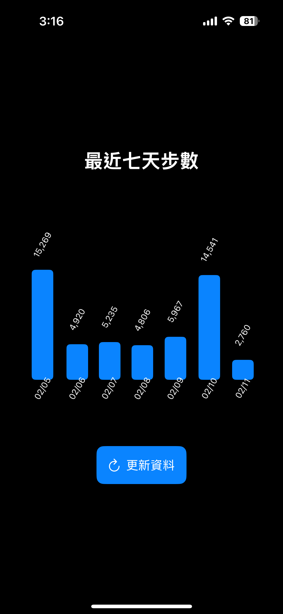

# 步數追蹤器 (Step Tracker)

這是一個使用 SwiftUI 和 HealthKit 開發的 iOS 應用程式，用於追蹤和顯示使用者最近七天的步數資料。

## 功能特色

- 讀取 HealthKit 中的步數資料
- 以長條圖視覺化呈現最近七天的步數
- 支援手動更新資料
- 清晰的日期和步數標示

## 畫面截圖

## 系統需求

- iOS 14.0 或更新版本
- 需要實體裝置（iPhone）才能存取 HealthKit 資料
- Xcode 13.0 或更新版本

## 安裝說明

1. 複製專案到本機
2. 使用 Xcode 開啟專案
3. 在 Xcode 中設定開發者帳號
4. 在實體 iPhone 上執行專案

## 使用說明

1. 首次執行時會請求健康資料存取權限
2. 授權後即可看到最近七天的步數統計
3. 點擊更新按鈕可重新載入最新資料

## 技術說明

- 使用 SwiftUI 建構使用者介面
- 透過 HealthKit 存取健康資料
- 採用 MVVM 架構設計
- 使用 Combine 框架處理資料流

## 注意事項

- 模擬器無法存取 HealthKit 資料，請在實體裝置上測試
- 需要在 Xcode 的 Capabilities 中啟用 HealthKit
- 確保在 Info.plist 中已設定適當的隱私權限說明

## 授權條款

[在此加入授權條款]

## 作者

[在此加入作者資訊] 